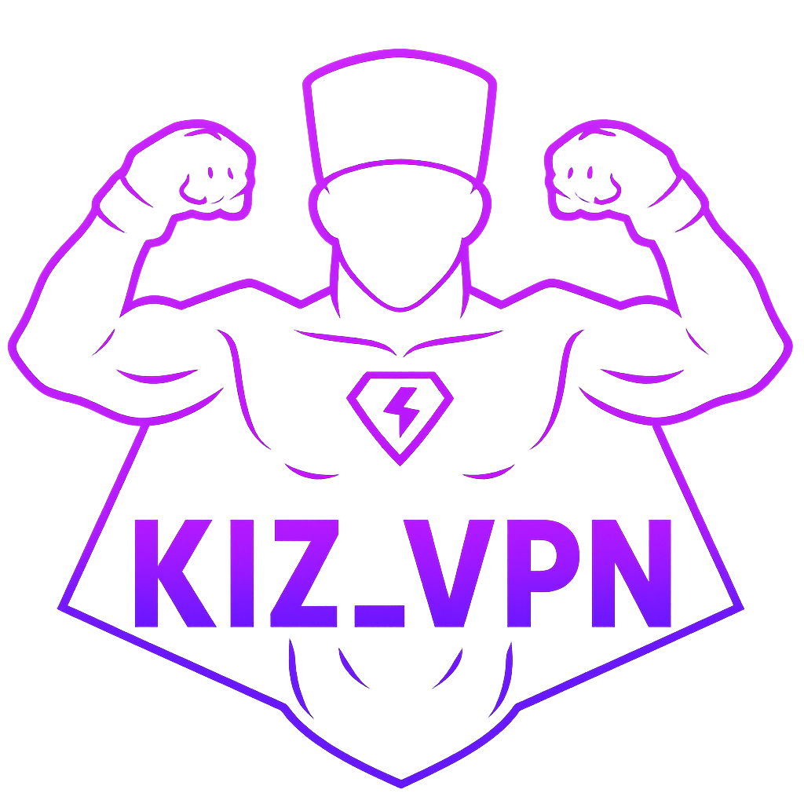

<div align="center">



# KIZ VPN

**Современный Android VPN клиент с поддержкой VLESS и WireGuard**

[](https://android.com)
[](LICENSE)
[](https://kotlinlang.org)
[](https://github.com/eXLu51ve-gjj/kiz-vpn-client/releases/latest)

📖 **Languages:** [🇷🇺 Русский](README.ru.md) | [🇬🇧 English](README.md)

</div>

---

## ✨ Возможности

### Основная функциональность
- 🔒 **Протокол VLESS** - Полная поддержка Reality, WebSocket, TLS/XTLS
- 🛡️ **Протокол WireGuard** - Современный, быстрый и безопасный VPN
- ⚡ **Плитка быстрых настроек** - Переключение VPN из шторки уведомлений
- 📊 **Статистика в реальном времени** - Мониторинг скорости загрузки/выгрузки
- 🌓 **Темная тема** - Красивый современный интерфейс на Jetpack Compose

### Расширенные возможности
- 📅 **Управление подписками** - Отслеживание оставшихся дней/часов
- 📷 **Сканер QR кодов** - Простой импорт конфигов
- 🔄 **Автоподключение** - Запуск VPN при старте приложения
- 📜 **История подключений** - Отслеживание всех VPN сессий
- 🔗 **Поддержка Deep Link** - Импорт конфигов из Telegram бота
- 📱 **Множественные конфиги** - Сохранение и переключение между конфигами

---

## 📥 Скачать

### Последний релиз

[](https://github.com/eXLu51ve-gjj/kiz-vpn-client/releases/latest)

**Текущая версия:** v2.2.1  
**Размер:** ~162 MB  
**Минимум Android:** 8.0 (API 26)

[📦 Скачать последний APK](https://github.com/eXLu51ve-gjj/kiz-vpn-client/releases/latest/download/KIZ_VPN.public.2.2.1.apk)

### Установка

1. Скачайте APK файл
2. Включите "Установка из неизвестных источников" в настройках
3. Откройте APK файл и установите
4. Выдайте разрешение VPN при запросе

### ⚠️ Важные замечания

**Это демо-версия:**
- ✅ **VPN работает с любым VLESS/WireGuard конфигом**
- ✅ Все основные функции VPN работают
- ❌ Управление подписками требует настройки API сервера
- ❌ Активация ключей требует настройки API сервера

**Как использовать:**
1. Вставьте ваш VLESS или WireGuard конфиг
2. Подключитесь - VPN будет работать!
3. Информация о подписке не отображается (требуется собственный сервер)

**Для полной функциональности:**
- Настройте собственную 3x-ui панель
- Обновите настройки сервера в коде (см. раздел Начало работы)

**Примечание:** Это неподписанная debug сборка. Вы можете увидеть предупреждение от Google Play Protect - это нормально для приложений, установленных вне Play Store.

---

## 📱 Скриншоты

### Основной интерфейс

<div align="center">

<table>
  <tr>
    <td><br/><b>Главный экран - Отключено</b><br/>Красивый анимированный интерфейс</td>
    <td><br/><b>Главный экран - Подключено</b><br/>Активный VPN с анимацией</td>
    <td><br/><b>Статистика сети</b><br/>Мониторинг трафика в реальном времени</td>
  </tr>
</table>

</div>

### Функции

<div align="center">

<table>
  <tr>
    <td><br/><b>Настройки</b><br/>Информация о подписке: осталось 364 дня</td>
    <td><br/><b>История подключений</b><br/>Отслеживайте все VPN сессии</td>
  </tr>
</table>

</div>

### Плитка быстрых настроек

<div align="center">

<table>
  <tr>
    <td><br/><b>Быстрые настройки - Активны</b><br/>VPN включен из панели уведомлений</td>
    <td><br/><b>Быстрые настройки - Доступны</b><br/>Управление VPN одним нажатием</td>
    <td><br/><b>Уведомление VPN</b><br/>Показывает подписку: осталось 12 месяцев</td>
  </tr>
</table>

</div>

### 🎬 Видео демонстрация

<div align="center">

[📹 Посмотреть видео демонстрацию](media/Screen_Recording_20251111_195956_KIZ%20VPN.mp4)

*Краткая демонстрация процесса VPN подключения*

> **Примечание:** Нажмите ссылку выше чтобы скачать и посмотреть видео демо (4 MB)

</div>

---

## 🚀 Начало работы

### Требования
- Android Studio Arctic Fox или новее
- JDK 11 или выше
- Android SDK (минимум API 26)

### Настройка

1. **Клонируйте репозиторий**
```bash
git clone https://github.com/eXLu51ve-gjj/kiz-vpn-client.git
cd kiz-vpn-client
```

2. **Настройте параметры сервера**

Отредактируйте `MainActivity.kt`:
```kotlin
private val apiClient = VpnApiClient(
    baseUrl = "http://YOUR_SERVER_IP:YOUR_API_PORT",
    subscriptionPort = YOUR_SUBSCRIPTION_PORT
)
```

Отредактируйте `VpnApiClient.kt`:
```kotlin
class VpnApiClient(
    private val baseUrl: String = "http://YOUR_SERVER_IP:YOUR_API_PORT",
    private val subscriptionPort: Int = YOUR_SUBSCRIPTION_PORT
)
```

Отредактируйте `AndroidManifest.xml` (если используете deep links):
```xml
<data
    android:scheme="https"
    android:host="your-domain.com"
    android:pathPrefix="/connect" />
```

3. **Соберите проект**
```bash
./gradlew assembleDebug
```

Или в Android Studio:
```
Build → Build Bundle(s) / APK(s) → Build APK(s)
```

---

## 📖 Документация

- [Список функций](FEATURES_LIST.md) - Полный список возможностей
- [Благодарности](CREDITS.md) - Информация о лицензировании и благодарности

---

## 🎯 Ключевые возможности

### Плитка быстрых настроек
Переключайте VPN прямо из шторки уведомлений одним нажатием. Плитка показывает:
- Статус подключения (активен/неактивен)
- Информацию о подписке (оставшиеся дни)

### Управление подписками
- Автоматическая проверка подписки
- Отображение оставшегося времени (дни/часы)
- Интеграция с 3x-ui панелью
- Проверка подписки через API

### Поддержка нескольких протоколов
- **VLESS:** Полная реализация Xray-core с Reality, WebSocket, TLS
- **WireGuard:** Нативная реализация с высокой производительностью

---

## 🔧 Конфигурация

### Импорт конфигов

**Метод 1: Вставка из буфера обмена**
- Скопируйте ваш конфиг
- Откройте приложение → Настройки → Вставить конфиг

**Метод 2: QR код**
- Откройте приложение → Сканировать QR код
- Наведите камеру на QR код

**Метод 3: Deep Link**
- Нажмите на kizvpn:// или https:// ссылку
- Приложение откроется автоматически с конфигом

**Метод 4: Telegram бот**
- Получите конфиг от вашего бота
- Нажмите на ссылку
- Приложение импортирует автоматически

---

## 🏗️ Архитектура

```
app/
├── vpn/                  # VPN сервис и плитка
│   ├── KizVpnService     # Основной VPN сервис
│   └── KizVpnTileService # Плитка быстрых настроек
├── ui/                   # UI компоненты (Jetpack Compose)
│   ├── screens/          # Экраны приложения
│   ├── components/       # Переиспользуемые компоненты
│   └── viewmodel/        # ViewModels
├── api/                  # API клиент
├── config/               # Парсер конфигов
└── xrayconfig/           # Классы конфигурации Xray
```

---

## 📜 Лицензия

Этот проект лицензирован под **GPL-3.0** в связи с использованием кода ядра XiVPN.

Подробности в [LICENSE](LICENSE).

---

## 🙏 Благодарности

### VPN ядро
Этот проект использует VPN ядро из [XiVPN](https://github.com/Exclude0122/XiVPN):
- **Автор:** Exclude0122
- **Лицензия:** GPL-3.0

#### Что взято из XiVPN:
- `libxivpn.so` - Нативная библиотека для маршрутизации VPN
- Архитектура VPN сервиса
- Поддержка протоколов VLESS и WireGuard
- Слой IPC коммуникации

#### Наши дополнения:
- Современный UI/UX на Jetpack Compose
- Плитка быстрых настроек
- Система управления подписками
- Интеграция с 3x-ui панелью
- Поддержка Telegram бота
- Сканер QR кодов
- История подключений
- Управление множественными конфигами

Подробная информация в [CREDITS.md](CREDITS.md).

---

## 🤝 Вклад в проект

Приветствуются любые вклады! Пожалуйста, не стесняйтесь отправлять Pull Request.

### Как внести вклад:
1. Сделайте Fork репозитория
2. Создайте ветку для функции (`git checkout -b feature/AmazingFeature`)
3. Закоммитьте изменения (`git commit -m 'Add some AmazingFeature'`)
4. Отправьте в ветку (`git push origin feature/AmazingFeature`)
5. Откройте Pull Request

---

## 📞 Контакты

- 📧 **Email:** [nml5222600@mail.ru](mailto:nml5222600@mail.ru)
- 💬 **Telegram:** [@eXLu51ve](https://t.me/eXLu51ve)
- 🐙 **GitHub:** [Issues](https://github.com/eXLu51ve-gjj/kiz-vpn-client/issues)

---

## ⚠️ Отказ от ответственности

Этот VPN клиент предоставляется только для образовательных и легальных целей. Пользователи несут ответственность за соблюдение всех применимых законов и правил в своей юрисдикции.

---

## 📝 Список изменений

### Версия 2.2.1 (Текущая)
- ✅ Первый релиз
- ✅ Поддержка VLESS и WireGuard
- ✅ Плитка быстрых настроек
- ✅ Управление подписками
- ✅ Современный UI на Jetpack Compose
- ✅ Сканер QR кодов
- ✅ История подключений
- ✅ Поддержка множественных конфигов

---

## 🔮 Планы развития

- [ ] Поддержка протокола OpenVPN
- [ ] Пользовательские настройки DNS
- [ ] Раздельное туннелирование
- [ ] Функция Kill Switch
- [ ] Светлая тема
- [ ] Поддержка виджетов
- [ ] Интеграция с Tasker

---

<div align="center">

**Сделано с ❤️ для тех, кто ценит приватность**

⭐ **Поставьте звезду если проект полезен!** ⭐

</div>

